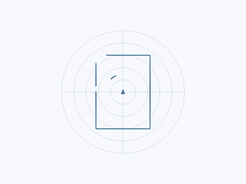

# ROS 2 for Dart & Flutter

A type-safe ROS 2 client and widget toolkit, talking to robots through
[`rosbridge_suite`](https://github.com/RobotWebTools/rosbridge_suite) over a
single WebSocket. No ROS installation on the client, so it runs on Android,
iOS, Linux, macOS, Windows and the web.

| Package | What it is |
|---|---|
| [`packages/ros2_client`](packages/ros2_client) | Pure-Dart client: topics, services, actions, parameters, introspection |
| [`packages/ros2_flutter`](packages/ros2_flutter) | Flutter widgets: connection lifecycle, camera, lidar, teleop, tf |
| [`packages/ros2_msgs_common`](packages/ros2_msgs_common) | Pre-generated classes for nav2, control, tf2, markers and friends |

<p align="center">
  
  &nbsp;&nbsp;
  
</p>

**[Installation](doc/installation.md) · [Tutorial](doc/tutorial.md) ·
[Roadmap](docs/ROADMAP.md)**

Repo: <https://github.com/RPRKLR/ros2-dart>

## Quick start

On the robot:

```bash
sudo apt install ros-humble-rosbridge-suite
ros2 launch rosbridge_server rosbridge_websocket_launch.xml
```

Console client:

```bash
cd packages/ros2_client
dart pub get
dart run example/ros2_client_example.dart ws://<robot-ip>:9090
```

Flutter control panel:

```bash
cd packages/ros2_flutter/example
flutter run
```

## Tests

```bash
cd packages/ros2_client      && dart test     # 169 tests, incl. 8 end-to-end
cd packages/ros2_flutter     && flutter test  # 10 widget tests
cd packages/ros2_msgs_common && dart test     # 8 registration tests
```

The end-to-end tests spawn a local Tornado server speaking the rosbridge
protocol, so they need no ROS install. They skip themselves if `python3` or
`tornado` is unavailable.
