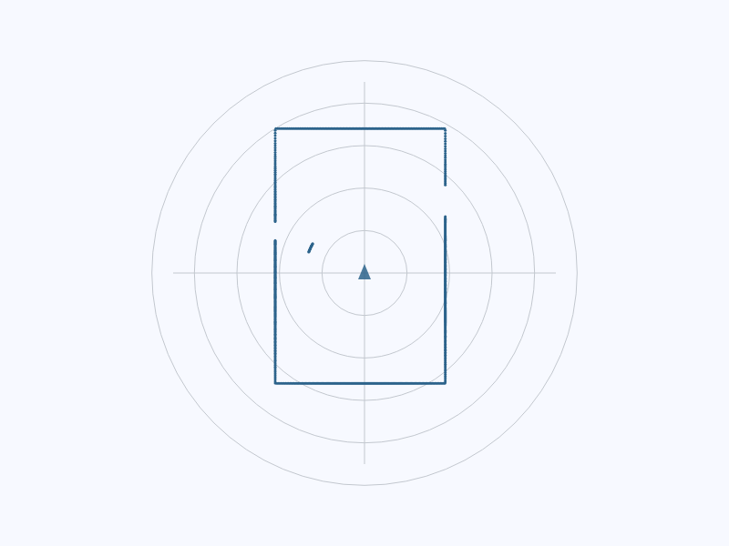

# Tutorial: a teleop panel in about fifty lines

Builds a panel that shows the robot's lidar, drives it with a joystick, and
displays its battery — starting from an empty Flutter project. Assumes
rosbridge is running; see [installation](installation.md).

<p align="center">
  
</p>

---

## 1. Connect

Everything else lives under a `RosConnection`. It owns the client, connects on
mount, closes on dispose, and reconnects when the app comes back from the
background — the lifecycle most hand-rolled ROS/Flutter glue gets wrong.

```dart
import 'package:flutter/material.dart';
import 'package:ros2_flutter/ros2_flutter.dart';

void main() {
  registerStandardMessages();
  runApp(const TeleopApp());
}

class TeleopApp extends StatelessWidget {
  const TeleopApp({super.key});

  @override
  Widget build(BuildContext context) => MaterialApp(
        home: RosConnection(
          uri: Uri.parse('ws://robot.local:9090'),
          child: const Scaffold(body: Panel()),
        ),
      );
}
```

## 2. Show whether you are actually connected

Do this before anything else. A robot UI that cannot tell you it is offline is
worse than no UI, and this is two lines:

```dart
RosConnectionBuilder(
  builder: (context, state) => switch (state) {
    RosConnectionState.connected => const Text('connected'),
    RosConnectionState.reconnecting => const Text('reconnecting…'),
    _ => const Text('offline'),
  },
)
```

## 3. Draw the lidar

```dart
const RosLaserScanView(topic: '/scan', maxRange: 8.0)
```

That is the whole thing. The widget subscribes with `QosProfile.sensorData`
already applied, because lidar is almost always published best-effort and a
reliable subscriber matches *nothing* — receiving no data, with no error. It
requests CBOR, so the ranges arrive as a `Float32List` rather than a JSON array
of numbers.

<p align="center">
  
</p>

## 4. Drive

```dart
const TeleopJoystick(topic: '/cmd_vel', maxLinearSpeed: 0.4)
```

<p align="center">
  
</p>

It publishes a zero `Twist` on release **and** on dispose, and repeats the held
command at a fixed rate so a watchdog-equipped robot does not stall mid-motion.
It also advertises `perishable: true`, which matters more than it sounds:
without it, commands issued during a network stall are buffered and replayed
when the link recovers — handing the robot seconds of stale motion *after* the
operator has let go.

Prefer buttons? `TeleopPad` is the same contract with a D-pad.

## 5. Show any topic

`RosTopicBuilder` subscribes for the widget's lifetime and rebuilds on each
message. The subscription is cancelled on dispose, so navigating away actually
unsubscribes from the bridge instead of leaking for the life of the app.

```dart
RosTopicBuilder<BatteryState>(
  topic: '/battery_state',
  builder: (context, battery) => Text(
    battery == null ? '—' : '${(battery.percentage * 100).round()}%',
  ),
)
```

It defaults to `Backpressure.latest`: a widget draws the newest value and
nothing else, so messages that arrive faster than it rebuilds are dropped
*before* being decoded rather than queued up to be rendered late.

## 6. Put it together

```dart
class Panel extends StatelessWidget {
  const Panel({super.key});

  @override
  Widget build(BuildContext context) => Column(
        children: [
          RosConnectionBuilder(
            builder: (context, state) => ListTile(
              title: Text(state.name),
              leading: Icon(state == RosConnectionState.connected
                  ? Icons.link
                  : Icons.link_off),
              trailing: RosTopicBuilder<BatteryState>(
                topic: '/battery_state',
                builder: (context, b) => Text(
                    b == null ? '—' : '${(b.percentage * 100).round()}%'),
              ),
            ),
          ),
          const Expanded(child: RosLaserScanView(maxRange: 8.0)),
          const Padding(
            padding: EdgeInsets.all(24),
            child: TeleopJoystick(maxLinearSpeed: 0.4),
          ),
        ],
      );
}
```

---

## Beyond the widgets

### Call a service

```dart
final ros = RosConnection.of(context);
final result = await ros.callService<SpawnRequest, SpawnResponse>(
    '/spawn', const SpawnRequest(x: 2, y: 3, name: 'turtle2'));
```

### Run an action, with feedback

```dart
final goal = ros.sendGoal<NavigateToPoseGoal, NavigateToPoseFeedback,
    NavigateToPoseResult>('/navigate_to_pose', myGoal);

goal.feedback.listen((f) => print('${f.distanceRemaining} m to go'));
await goal.result;                     // throws ActionFailedException if aborted
```

Pass a `timeout:` — a goal sent to an action server that is not there gets no
reply at all, and would otherwise never complete.

### Where is the robot?

```dart
TfFrameBuilder(
  targetFrame: 'map',
  sourceFrame: 'base_link',
  builder: (context, transform) => transform == null
      ? const Text('waiting for tf…')
      : Text('${transform.translation.x.toStringAsFixed(2)} m'),
)
```

Every widget under one `RosConnection` shares a single TF listener, because
`/tf` runs at 50–200 Hz and a listener per widget would multiply both bridge
traffic and decode cost by the number of widgets on screen.

### Your robot's own message types

No hand-writing required. Generate from source:

```bash
dart run ros2_client:generate -o lib/msgs -s ~/ws/install my_robot_msgs
```

…or straight from the running robot, with no ROS install on your machine at
all:

```bash
dart run ros2_client:generate -o lib/msgs -r ws://robot.local:9090 my_robot_msgs
```

---

## Two things that trip everyone up

**QoS mismatch.** A reliable subscriber never matches a best-effort publisher
and you receive *nothing* — no error, no warning. Sensor topics are almost
always best-effort:

```dart
ros.subscribe<LaserScan>('/scan', qos: QosProfile.sensorData);
```

Latched topics like `/map` and `/robot_description` need
`QosProfile.transientLocal`.

**JSON destroys `inf` and `nan`.** rosbridge serialises every non-finite float
as `null`, so over plain JSON an out-of-range lidar beam and an invalid one are
indistinguishable. CBOR preserves both, which makes it a correctness choice and
not only a fast one — and it is the default here for that reason.

Listen to `ros.status` while developing. It carries the client's own
diagnostics: connection errors, dropped fragments, buffer overflows, and
warnings when one subscription's options silently override another's.
